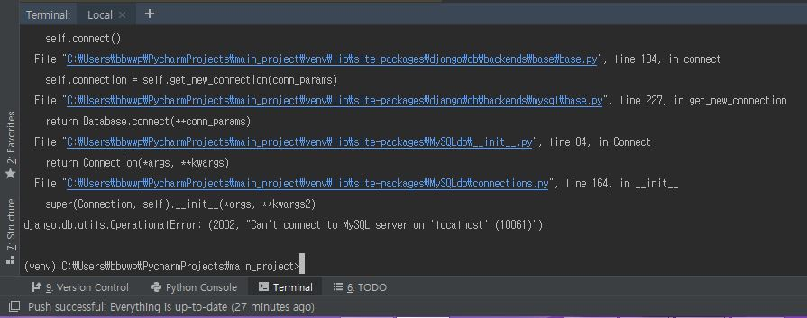
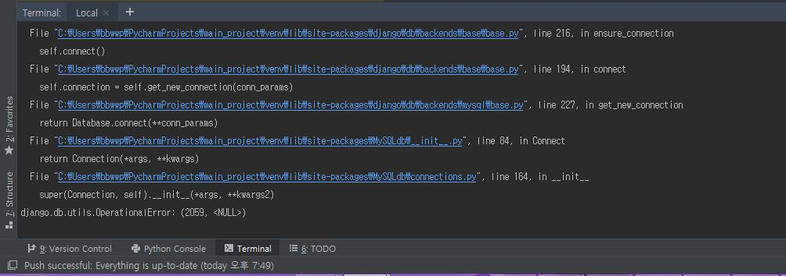

# 창의학기제_장고프로젝트

---
### 주요기능

1. 게시판 모듈화
2. 문서공유
3. 파일보관
4. 채팅
5. 게시판 익명기능
6. 업로드한 파일끼리 유사도 비교
7. 채팅로그를 기반으로 가산점 부과

---
### 개발상황

1. 웹 사이트 기본기능
   - ~~기본 로그인, 로그아웃, 회원가입 기능 구현 (MySQL과 연동 완료)~~
   - ~~전체적인 웹 페이지 템플릿 구조 구현 및 디자인 템플릿 적용~~
   - 세부적인 사이트 맵 구상과 세부 디자인 수정 필요 
2. 게시판 모듈화
3. 문서공유(04/04)
      - FireBase의 Firepad API를 이용한 문서공유 시스템 구현중
      - 웹 사이트 접속시 기본적인 문서공유는 되나 같은 그룹 회원끼리의 문서공유는 아직 안돼서 구현중
      - 그룹(과제) 테이블을 만들어서 문서공유 관련 정보를 DB에 저장할 계획
      - 장고에서 기본적으로 제공해주는 로그인 시스템 auth_user 테이블을 프록시 방식으로 확장해서 사용할 계획 
4. 파일보관
5. 채팅
   + ~~channels 라이브러리를 이용한 websocket 채팅~~ (04/03)
   + ~~부트스트랩 탬플릿 입히기~~ (04/03)
   + ~~보이스채팅 지원가능한지 찾기~~ > 가능은 하지만 어려움. 시간이 모자라서 굳이 필요할까 싶음. (04/03)
   + 기존 게시판 회원테이블과 연동

---

### 설치 라이브러리

  1. django (서버)

  2. matrix-admin-master (부트스트랩 템플릿 - 메인 UI)

  3. mysqlclient (버전 통합을 위해 파일 첨부 - mysqlclient-1.4.2-cp37-cp37m-win_amd64.whl)

     MySQLdb 는 Pyhton 3 에서 지원하지 않는다.

---

### 에러해결

 1. MySQL 연동 실패

    

    MySQL 서버 미설치로 인한 오류...

    mysqlclient만 설치하면 클라이언트단에서 접속해주는 모듈이므로 서버가 따로 있어야함...;;

    

 2. 

    mysqlclient파일이 꼬여서 생기는 오류. uninstall 해준 후, 다시 install하면 문제가 사라진다.

---

### 개발방법

##### 1. 기본적인 웹사이트

##### 2. 게시판 모듈화

##### 3. 문서공유

##### 4. 파일보관

##### 5. 채팅

+ channels 설치 : <https://channels.readthedocs.io/en/latest/installation.html>
+ win32api 설치 : pip install pypiwin32
+ channels_redis 설치 : pip install channels_redis
+ 도커 설치
  + window 버전
    + 도커 설치 : <https://steemit.com/kr/@mystarlight/docker>
    + redis 설치 : <https://hwigyeom.ntils.com/entry/Windows-%EC%97%90-Redis-%EC%84%A4%EC%B9%98%ED%95%98%EA%B8%B0-1>
    + docker run -p 6379:6379 -d redis:2.8
    + pip install channels_redis

<http://jeonghwan-kim.github.io/2018/01/25/before-jquery.html>